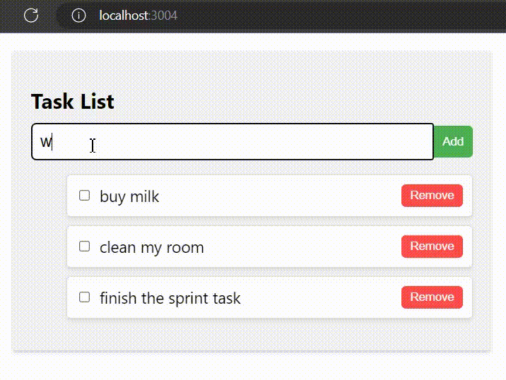

[](https://classroom.github.com/a/5zdSG4-j)
## Task for theme Typescript 

Create a TypeScript-enabled React application that allows the user to create a task list. The application should have the following features:  
•	Add a new task using an input field and an "add" button.  
•	Remove a task from the list using a "remove" button.  
•	Change the status of a task from "completed" to "uncompleted" and vice versa using a checkbox.  
Additionally, the application should have the ability to store the list of tasks in the browser's local storage and load it when the page is reopened.
 
   

Please use TaskList and TaskItem components for the implementation

TaskList component:

 - Should receive a list of tasks as props.
 - If list of tasks is not set in props, the component should try to retrieve it from the local storage.
 - Should store the list of tasks in the local storage under the key `"tasks"`    
 - Should render a title (`"Task List"`) and a list of TaskItem components.  
 - If the list of tasks is empty, should render a message saying "No tasks to display".  

TaskItem component:

 - Should receive props:
   - task: An object representing the task to be displayed. This object should have the following properties:
     - id: A unique identifier for the task. This property should be of type string.
     - text: The text of the task. This property should be of type string.
     - сompleted: A boolean value that indicates whether the task has been completed or not. This property should be of type boolean.
   - onRemove: A callback function that will be called when the user clicks the "Delete" button on the task. The function should remove the task from the list of tasks. This prop should be of type (id: string) => void.
   - onToggle: A callback function that will be called when the user clicks the checkbox on the task. The function should toggle the completion status of the task. This prop should be of type (id: string) => void.  
 - Should render the task text and a checkbox that indicates whether the task is completed or not.  
 - If the task is completed, the text should have a strikethrough style.  
 - Should have a button to remove the task from the list.  
    
 Here is an example of how the TaskItem component might be used with these props:
 ```javascript 
 <TaskItem 
  task={{
    id: "1",
    text: "Buy groceries",
    сompleted: false
  }}
  onRemove={(id) => handleRemoveTask(id)}
  onToggle={(id) => handleToggleTask(id)}
/>
```
*Note: please, avoid using type 'any' in your implementation*
